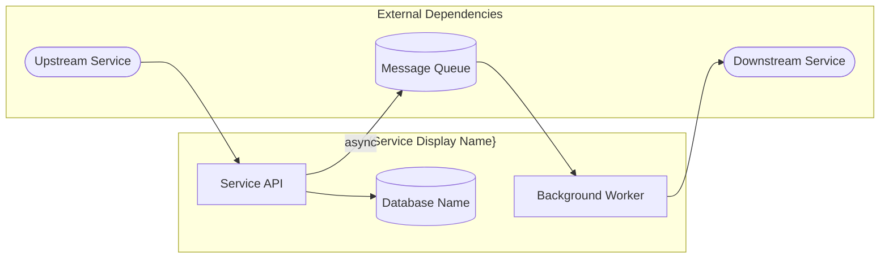

# Service Review Report Template

> Required output format for the dotnet-service-review agent. Follow this format exactly.

**Output this report as `SERVICE-REVIEW.md` in the repository root.**

```markdown
# Service Review: {REPO-NAME}

|                  |                       |
| ---------------- | --------------------- |
| **Health Score**              | 🟢 / 🟠 / 🔴            |
| **Modernization Readiness**  | 🟢 / 🟠 / 🔴            |
| **Scope**                    | `{repo root or subdirectory path}` |
| **Reviewed By**              | dotnet-service-review |
| **Review Date**              | {YYYY-MM-DD}          |
| **RoslynMCP**                | ✅ available / ⚠️ unavailable |

---

## Summary

{2-3 sentence overview of the repository's purpose and overall health assessment}

---

## Wiki Documentation

> Informational context only — does not affect category scores. Omit this section if no wiki MCP was available.

| Wiki Page    | URL   |
| ------------ | ----- |
| {Page title} | {URL} |

**Key Insights from Wiki:**
- {Insight 1 — architectural context, design decisions, etc.}
- {Insight 2}

**Discrepancies Between Wiki and Code:**
- {Any mismatches between documented and actual implementation, or "None identified"}

---

## Architecture & Data Flow

> High-level view of the service's architecture, integrations, and data flow.

### Architecture Overview

{2-4 sentences describing the service's role in the broader system, its architectural style (monolith, microservice, batch processor, API gateway, etc.), and key technology choices.}

### Data Flow Diagram

> Mermaid flowchart diagram showing inbound/outbound data flows, dependencies, databases, queues, and external integrations. Always use `flowchart LR` — do NOT use `architecture-beta` or `block-beta` (experimental, poor rendering support).



{Replace the example above with actual architecture derived from code analysis. Guidelines:}
- {**Include**: Projects in the solution, databases, message queues/topics, external APIs, upstream callers, downstream dependencies}
- {**Label edges** with protocols/formats where known (REST, gRPC, RabbitMQ, SQL, file drop, etc.)}
- {**Group** components that belong to this service vs. external dependencies}
- {**Source**: Derive from connection strings, HttpClient registrations, queue bindings, service references. Cross-reference with GitNexus data when available. Validate against wiki.}

### Key Integration Points

| Direction  | System                | Protocol                    | Notes                              |
| ---------- | --------------------- | --------------------------- | ---------------------------------- |
| Inbound    | {Upstream caller}     | {REST / gRPC / Queue}       | {Endpoint or queue name}           |
| Outbound   | {Downstream dep}      | {REST / gRPC / SQL / File}  | {What data flows and why}          |
| Data Store | {Database / Cache}    | {SQL Server / Redis / etc.} | {Connection string config location}|

### Data Flow Observations

- {Observation 1 — e.g., "No circuit breaker on the outbound call to Payment Gateway"}
- {Observation 2 — e.g., "Database shared with Service X — violates database-per-service pattern"}
- {Observation 3 — e.g., "File drop integration with no retry or dedup mechanism"}
- {Or "No significant architectural concerns identified"}

### Contributor & Bus Factor

- {Total contributors: N, top contributor: X (Y% of commits)}
- {Bus factor assessment — single contributor = high risk, 2-3 = moderate, 4+ = healthy}
- {Impact on onboarding, knowledge silos, review coverage}

---

## Build & Test Results

| Check                   | Result                                       | Details                              |
| ----------------------- | -------------------------------------------- | ------------------------------------ |
| **Build**               | ✅ Success / ⚠️ Warnings / ❌ Failed            | {error count, warning count, or N/A} |
| **Tests**               | ✅ Passed / ⚠️ Some Failed / ❌ Failed / ➖ None | {X passed, Y failed, Z skipped}      |
| **Vulnerable Packages** | ✅ None / ⚠️ Low/Moderate / ❌ High/Critical    | {list any vulnerable packages}       |

**Build Output:**

```
{Key build messages, warnings, or errors — truncated if verbose}
```

**Test Output:**
```
{Test summary or "No tests found"}
```

---

## Category Scores

| Category              | Score | Notes                 |
| --------------------- | ----- | --------------------- |
| Code Quality & Design | 🟢/🟠/🔴 | {Brief justification} |
| .NET Practices        | 🟢/🟠/🔴 | {Brief justification} |
| Testing               | 🟢/🟠/🔴 | {Brief justification} |
| Security              | 🟢/🟠/🔴 | {Brief justification} |
| Maintainability       | 🟢/🟠/🔴 | {Brief justification} |

### Modernization Readiness Scores

> Separate from the health score — assesses readiness for .NET modernization.

| Category | Score | Notes |
| -------- | ----- | ----- |
| Migration Complexity | 🟢/🟠/🔴 | {Brief justification} |
| Runtime & Deployment | 🟢/🟠/🔴 | {Brief justification} |
| **Modernization Readiness** | **🟢/🟠/🔴** | {Composite of above two scores} |

---

## Documentation Status (Informational)

> Assessed for awareness — does not affect the health score.

| Aspect             | Status | Notes              |
| ------------------ | ------ | ------------------ |
| README             | 🟢/🟠/🔴  | {Brief assessment} |
| Setup Instructions | 🟢/🟠/🔴  | {Brief assessment} |
| API Documentation  | 🟢/🟠/🔴  | {Brief assessment} |

---

## Critical Findings

> Auto-red triggers or immediate concerns

- {List critical issues, or "None"}

---

## Detailed Findings

### Code Quality & Design

**Score: 🟢/🟠/🔴**

#### Roslyn Code Metrics

> Include this table when RoslynMCP is available. Omit if RoslynMCP was unavailable.

| File | Cyclomatic Complexity | Maintainability Index |
| ---- | --------------------- | --------------------- |
| {Top 5 files by complexity} | | |

{Specific observations about SOLID principles, naming, structure, duplication, extensibility contracts. Include file:line references.}

### .NET Practices

**Score: 🟢/🟠/🔴**

{Specific observations about async/await, DI (or absence of DI), exception handling, async mismatches, modern C# usage, package management format (packages.config vs PackageReference). Include file:line references.}

### Testing

**Score: 🟢/🟠/🔴**

{Specific observations about test presence, coverage, quality. Include file:line references.}

#### Current Testing Trophy

> Visual representation of existing test distribution.

```
┌─────────────────────────────────────────────────────────────┐
│ E2E Tests: {count} — {list what exists or 'None'}      🔴  │
├─────────────────────────────────────────────────────────────┤
│ Integration Tests: {count} — {list or 'None'}           🟠  │
├─────────────────────────────────────────────────────────────┤
│ Unit Tests: {count} — {list or 'None'}                  🟢  │
├─────────────────────────────────────────────────────────────┤
│ Static Analysis: {analyzers, nullable, warnings-as-errors}  │
└─────────────────────────────────────────────────────────────┘
```

> **Note:** Use a plain-text ASCII table for the testing trophy — do NOT use `block-beta` Mermaid diagrams (experimental, poor rendering support).

{Replace with actual counts. Guidelines:}
- {**E2E**: Selenium, Playwright, WebApplicationFactory with real DB, smoke tests}
- {**Integration**: Tests hitting real infrastructure (DB, message broker, file system, TestContainers)}
- {**Unit**: Isolated tests with mocked dependencies, business logic in isolation}
- {**Static Analysis**: Roslyn analyzers, nullable refs, `TreatWarningsAsErrors`, `.editorconfig`, StyleCop}
- {Zero tests at a layer = "None" — this is the gap recommendations should address}

#### Testing Trophy Gap Analysis

> Components that should have tests but currently do not. Prioritized by risk.

**Unit Test Gaps** (business logic without test coverage)

| Component | File | Risk | Reason |
|-----------|------|------|--------|
| {ClassName} | {file:line} | High/Medium/Low | {e.g., "Complex fee calculation with 8 branches, no tests"} |

**Integration Test Gaps** (infrastructure without test coverage)

| Component | File | Risk | Reason |
|-----------|------|------|--------|
| {ClassName} | {file:line} | High/Medium/Low | {e.g., "6 SQL queries via EF6, no data tests"} |

**E2E Test Gaps** (API endpoints without end-to-end coverage)

| Endpoint | Controller | Risk | Reason |
|----------|-----------|------|--------|
| {route} | {ClassName} | High/Medium/Low | {e.g., "Financial mutation endpoint, no E2E test"} |

**Static Analysis Gaps**
- {e.g., "Nullable context not enabled"}
- {e.g., "No .editorconfig"}

#### Migration Safety Net

> Render only when target framework is .NET Framework 4.x.
> If .NET 6+, render: "Not applicable — service is already on a modern .NET runtime."

> Tests needed before migrating from {current framework} to .NET 8+.
> Without these, migration regressions may go undetected.

| Category | What Needs Testing | Current Coverage | Priority |
|----------|-------------------|-----------------|----------|
| API Contracts | {N} controllers, {M} endpoints | {X} integration tests | 🔴/🟠/🟢 |
| Data Access | EF6 DbContext with {N} entity types | {X} data tests | 🔴/🟠/🟢 |
| Configuration | {N} custom config sections | {X} config tests | 🔴/🟠/🟢 |
| Auth Pipeline | {auth type} in {N} files | {X} auth tests | 🔴/🟠/🟢 |

**Pre-Migration Testing Checklist:**
- [ ] Add characterization tests for all API endpoints (request/response snapshots)
- [ ] Add data access tests verifying query results (golden master for EF Core comparison)
- [ ] {Additional items specific to findings}

**Migration Risk Without Tests:**
{1-2 sentences summarizing risk if migration proceeds without the safety net}

#### Recommended Testing Strategy

> What this service's testing trophy **should** look like. Prioritized by layer, specific to this service's responsibilities.

**Static Analysis (foundation — enforce first)**
- {e.g., Enable `<Nullable>enable</Nullable>` and `<TreatWarningsAsErrors>true</TreatWarningsAsErrors>`}
- {e.g., Add `.editorconfig` with coding standards enforcement}
- {e.g., Enable relevant Roslyn analyzers (CA1xxx, SA1xxx)}

**Unit Tests (business logic isolation)**
- {e.g., Payment calculation logic — verify rounding, currency handling, edge cases}
- {e.g., Validation rules — verify rejection of invalid inputs}
- {e.g., State machine transitions — verify valid/invalid state changes}

**Integration Tests (largest layer — highest confidence)**
- {e.g., Repository layer against real SQL Server (TestContainers)}
- {e.g., Message consumer with real RabbitMQ — verify dedup, DLQ behavior}
- {e.g., HTTP endpoints via WebApplicationFactory — verify auth, routing, serialization}

**E2E Tests (minimal — critical paths only)**
- {e.g., Payment submission happy path end-to-end}
- {Or "Not applicable for this service type (batch processor / library / internal API)"}

### Security

**Score: 🟢/🟠/🔴**

{Specific observations about secrets, vulnerabilities, auth patterns, path traversal, idempotency gaps, security scan history. Include file:line references AND inline code snippets for every vulnerability found. Show the problematic code.}

### Maintainability

**Score: 🟢/🟠/🔴**

{Specific observations about dependencies, activity, build health. Include dates and version numbers. For dependency freshness, verify actual latest versions — don't assume current versions are up to date. Note packages.config vs PackageReference if mixed.}

---

## Modernization Readiness

> Assessment of migration complexity and runtime/deployment profile for .NET modernization planning.
> **This score is separate from the overall health score.**

**Modernization Readiness: 🟢/🟠/🔴**

### Migration Complexity

**Score: 🟢/🟠/🔴**

| Signal | Status | Evidence |
|--------|--------|----------|
| Target Framework | 🟢/🟠/🔴 | {e.g., ".NET Framework 4.8 (`net48` in all .csproj files)"} |
| Package Format | 🟢/🟠/🔴 | {e.g., "PackageReference in all projects"} |
| Framework-Only APIs | 🟢/🟠/🔴 | {e.g., "System.Web used in 12 files, WCF client in 3 files"} |
| NuGet Compatibility | 🟢/🟠/🔴 | {e.g., "2 packages need replacement: Microsoft.AspNet.WebApi, Unity"} |
| API Surface Area | 🟢/🟠/🔴 | {e.g., "8 API controllers, 2 WCF service contracts"} |
| Data Access | 🟢/🟠/🔴 | {e.g., "EF6 with 15 migrations, 8 stored proc calls"} |
| Configuration | 🟢/🟠/🔴 | {e.g., "web.config with 3 custom config sections"} |

**Key Migration Blockers:**
- {List specific blockers or "None identified"}

**Framework-Only API Details:**
- {List each framework-only API found with file:line references and migration path}

### Runtime & Deployment

**Score: 🟢/🟠/🔴**

| Signal | Status | Evidence |
|--------|--------|----------|
| Hosting Model | 🟢/🟠/🔴 | {e.g., "IIS-hosted via System.Web pipeline (Global.asax present)"} |
| Containerization | 🟢/🟠/🔴 | {e.g., "No Dockerfile, no obvious blockers"} |
| CI/CD Pipeline | 🟢/🟠/🔴 | {e.g., "Azure DevOps YAML pipeline detected"} |
| Windows-Only Deps | 🟢/🟠/🔴 | {e.g., "EventLog usage (replaceable), no blocking deps"} |
| Platform Target | 🟢/🟠/🔴 | {e.g., "AnyCPU, no native dependencies"} |

**Windows-Only Dependency Details:**
- {List each Windows-only dep with severity (blocking/replaceable) and file:line references}

**Deployment Observations:**
- {Observations about deployment topology, environment coupling, or portability concerns}

---

## Documentation Details (Informational)

{Specific observations about README, setup instructions, API docs. Does not affect the health score.}

---

## Recommendations

> Top 3 actionable improvements

1. {Recommendation 1 — specific and actionable}
2. {Recommendation 2 — specific and actionable}
3. {Recommendation 3 — specific and actionable}

---

## Additional Notes

### Tool Availability

| Tool | Agent | Status | Impact |
| ---- | ----- | ------ | ------ |
| RoslynMCP | dotnet-code-reviewer | ✅ / ⚠️ | {If unavailable: "Code metrics and compiler diagnostics absent"} |
| RoslynMCP | dotnet-modernization-analyst | ✅ / ⚠️ | {If unavailable: "Framework compatibility analysis text-based only"} |
| GitNexus | dotnet-architect | ✅ / ⚠️ | {If unavailable: "Cross-repo integration context absent"} |
| Confluence | dotnet-architect | ✅ / ⚠️ | {If unavailable: "Wiki documentation section omitted"} |

{If RoslynMCP was unavailable for the code reviewer, include:}

> **⚠️ RoslynMCP Unavailable**
>
> RoslynMCP was not available during this review. The Roslyn Code Metrics table and compiler diagnostic findings are absent. Code quality and security findings rely on text-based pattern matching, which may miss issues requiring semantic analysis (type flow, nullability, captive dependencies). Re-run with `mcp-roslyn` enabled for deeper analysis.

{Other observations, context, caveats.}
